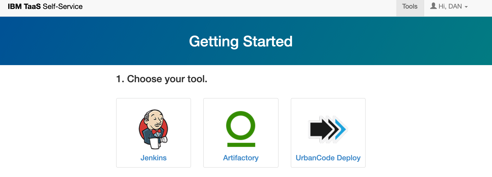

# Continous Integration on Kubernetes

---

## Stages

* Code is committed to github
* Github calls a hook to Jenkins on Kubernetes **JonK** to start build
* The src code is 
    * Built into a Container Image
    * Tagged
    * Pushed to Docker Artifactory
    * Once Image is pushed the CI logs into the cluster and uses helm to rollout the new image.
---

## Artifactory
- We already have a comprehensive article on getting up and running with artifactory and docker.
- [CIO Blog Artifactory](https://pages.github.ibm.com/CIOCloud/cio-blog/#/artifactory/)
---

## Jenkins on Kubernetes



---

## The setup

- Once JonK is provisioned the setup for linking your repositories is fairly straight forward and there are many guides.
- [TaaS Artifactory](https://taas-tools.w3ibm.mybluemix.net/#/)
---
 ## Caveats
- Since Jenkins in running on Kubernetes your docker builds are taking place inside a pod in Kubernetes meaning Docker in running inside Docker.
- Mostly will never notice this, however you must use the `Groovy Pipeline Syntax` and **NOT** the `Declarative Pipeline`
---


```groovy

node('kube_pod_slave'){
    withCredentials([
        usernamePassword(credentialsId: 'bluemix-admin', passwordVariable: 'BX_PSW', usernameVariable: 'BX_USR'),
        file(credentialsId: 'artifactory-npmrc', variable: 'NPMRC_BOX'),
        file(credentialsId: 'dev-portal-helm-values', variable: 'DEV_HELM_VALUES'),
        file(credentialsId: 'prod-portal-helm-values', variable: 'PROD_HELM_VALUES'),
        string(credentialsId: 'ibmcloud-apikey', variable: 'IBMCLOUD_API_KEY')
    ]) {
        slackSend(color: "warning", message: "Portal Build Triggered")
        stage('SCM') {
            def gitRepo = checkout scm
            def commitSHA = gitRepo.GIT_COMMIT
            SHORT = "${commitSHA[0..7]}" //Set shortname for container tag

            if(env.BRANCH_NAME == 'dev') {
                imageName = 'cio-portal-dev'
                helmDeployName = 'dev-portal'
                helmValues = DEV_HELM_VALUES
                _replicaCount = 3
            }

            if(env.BRANCH_NAME == 'master') {
                imageName = 'cio-portal'
                helmDeployName = 'cio-portal'
                helmValues = PROD_HELM_VALUES
                _replicaCount = 5
            } 
            if(env.BRANCH_NAME.startsWith('release/')) {
                darkName = env.BRANCH_NAME.split("/")[1] //Get Release Name
                imageName = "dark-portal"
                helmDeployName = "${darkName}-dark-portal"
            }
        } // End Stage
```
---

### Creating our Image
 - Here are building the image tagging it with a version and pushing it to artifactory.

```groovy
            sh """
            cp $NPMRC_BOX frontend/.npmrc
            cp $NPMRC_BOX backend/.npmrc
            docker build -t ${artifactory}/${imageName}:${SHORT} .
            docker login -u ${BX_USR} -p ${BX_PSW} $artifactory
            docker push ${artifactory}/${imageName}:${SHORT}
            """
```


---
### Versioning our images
  - There are many different approaches to this.
  - We are using the first 7 alphanumerics of the git commit sha

  ```sh

    $ git rev-parse --short HEAD
    $ e46cc4f //This is our image tag
  ```

  - This is useful because you can always checkout the code that is running inside a container. 
  - AVOID USING LATEST (unless your distributing the image publicly)
---
### Managing Releases with Helm/Tiller
 


---

### Charts

A Chart is just a template for all the yamls that make up your kubernetes deployment.

```yaml
...Deployment.yaml
 spec:
      containers:
        - name: {{ .Chart.Name }}
          image: "{{ .Values.image.repository }}:{{ .Values.image.tag }}"
          imagePullPolicy: {{ .Values.image.pullPolicy }}
...
```
---

### values.yaml

- The values file will define the variables that you are going to render into the chart on deployment. 
- This can include anything that you think might need to change over time for you deployment.
- You can also modify these values during the deployment command using the `--set` command

---

### For the case of CI

```groovy
          stage('Deploy') {
            sh"""
            ibmcloud config --check-version=false
            ibmcloud plugin install container-service -f
            ibmcloud login -a api.ng.bluemix.net -r us-south -c ***** -g ciocloudservices-public-rg
            ibmcloud cs cluster-config ciohybridcloud

            export KUBECONFIG=${kubeConfig}

            helm init --client-only
            helm upgrade --install ${helmDeployName} ./cio-portal -f ${helmValues} \
            --set image.repository=${artifactory}/${imageName} \
            --set image.tag=${SHORT} \
            --set replicaCount=${_replicaCount} \ 
            --reuse-values
            """
```

---

### We're Done

- At this point helm has rolled out the chart with the updates values for the image tag and our application is not deployed.


---

### Extra

- Helm is a much larger topic but there are many great guides and tutorials.

- [Helm Documentation](https://helm.sh/docs/)

- [CI/CD with Helm](https://medium.com/@gajus/the-missing-ci-cd-kubernetes-component-helm-package-manager-1fe002aac680)

- [Deepdive Jenkins on Kubernetes](https://www.blazemeter.com/blog/how-to-setup-scalable-jenkins-on-top-of-a-kubernetes-cluster/)
